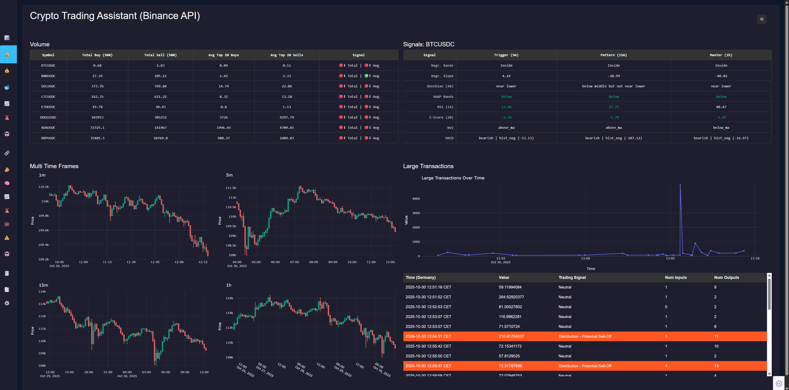
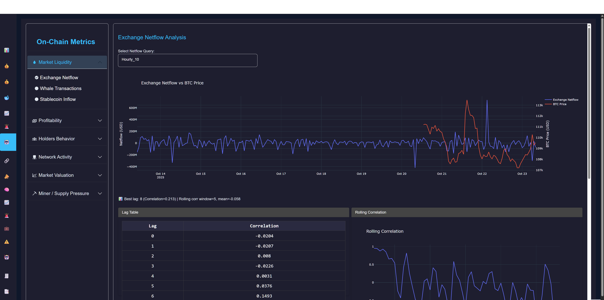
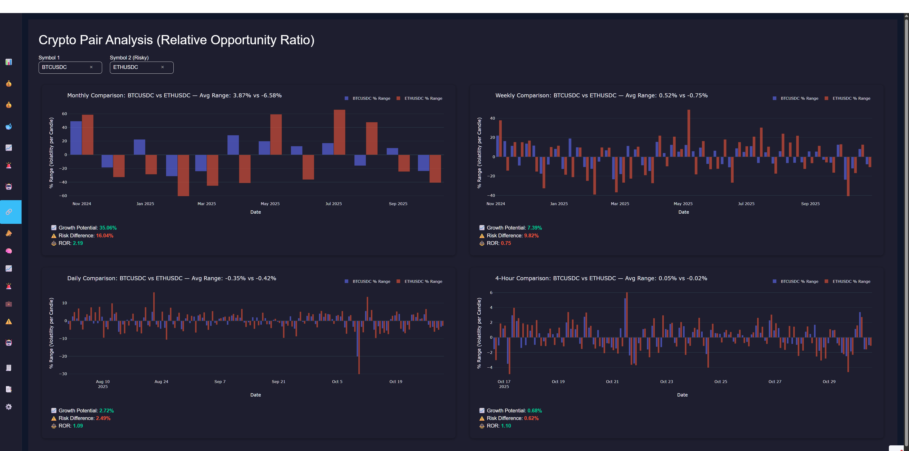
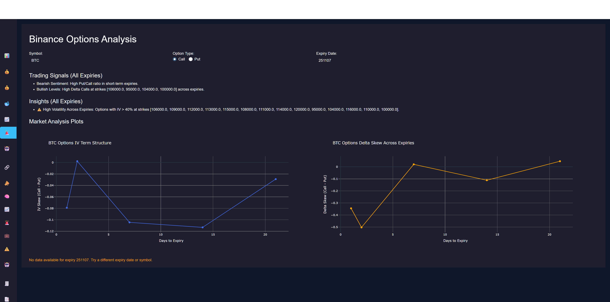

# Binance Trading Dashboard

Binance Trading Dashboard is a modular and professional-grade analytical platform built in Python using Dash, designed to give traders deep market insights, automated signal detection, and intelligent trade management — all in one clean and extensible interface.

This project was developed as part of an effort to create a real-world trading environment where data-driven decisions and automation converge.
It integrates Binance market data, on-chain analytics, and custom trading strategies through an elegant and scalable architecture — helping traders visualize, analyze, and execute with confidence.

The goal of this project is not just to display data, but to understand the market’s internal mechanics — identifying liquidity flows, major player activity, and key price structures in real-time.

## 📦 Features

📊 Comprehensive Trading Dashboard — Modular pages for price, liquidity, on-chain, portfolio, and signals analysis

⚙️ Object-Oriented Architecture — Clean, extensible class-based design

🛰️ Real-Time Market Scanning — Signal modules and Binance WebSocket integration

🤖 Automated Trading Support — Execute and manage trades via Binance API

💡 Risk Management Tools — Position sizing, stop-loss, and trade summary tracking

🔒 Secure API Handling — .env for credentials and configuration isolation

🧱 Scalable Structure — Easily add pages, data sources, or analytics modules

🧰 Supports Integration with Dune API — Combine on-chain and exchange data in one place

## 📸 Screenshots
### 📈 Trading Assistant
<p align="center">
  
</p>

### 📈 On-Chain Analysis
<p align="center">
  
</p>

### 📈 Pair Analysis
<p align="center">
  
</p>

### 📈 Options Analysis
<p align="center">
  
</p>

## 🗂️ Project Structure
```bash
crypto_dash/
├── app.py
├── analytics
│   ├── data_processing.py
│   └── market_liquidity
│       └── exchange_netflow.py
└── assets
│   └── styles
│   │   ├── styles.css
└── config
│   ├── settings.py
├── data_sources
│   └── dune_client.py
└── pages
│   ├── __init__.py
│   ├── home.py
│   ├── on_chain_analysis.py
│   ├── options_analysis.py
│   ├── pair_analysis.py
│   ├── portfolio.py
│   ├── price_analysis.py
│   ├── settings.py
│   ├── signals.py
│   ├── strategy.py
│   ├── trade_assistant.py
│   ├── trade_summary.py
│   └── transactions.py
├── README.md
├── requirements.txt
└── src
│   ├── layout.py
│   ├── navbar.py
│   ├── sidebar.py
└── utils
    ├── binance_data.py
    ├── helpers.py
    ├── options_data.py
    └── trading_functions.py

```

## 🛠️ Installation
```bash
# Clone the repo
git clone https://github.com/yourusername/crypto_dash.git
cd crypto_dash

# Create and activate virtual environment
python -m venv venv
.\venv\Scripts\activate   # Windows

# Install dependencies
pip install -r requirements.txt
```

🔐 Environment Variables
Create a .env file in the root directory with your Binance API credentials:

```bash
BINANCE_API_KEY=your_api_key_here
BINANCE_API_SECRET=your_api_secret_here
DUNE_API_KEY = your_dune_api_key_here
```

🚀 Usage
```bash
python app.py
```
You can modify the entry script or use strategy/testing/trading classes individually as needed.

✅ Requirements
Python 3.10+

Binance account with API access

See requirements.txt for dependencies

🧪 Disclaimer
This project is for educational and development purposes only. Trading cryptocurrencies involves significant risk and may result in loss of capital.

📄 License
See LICENSE for licensing information.

